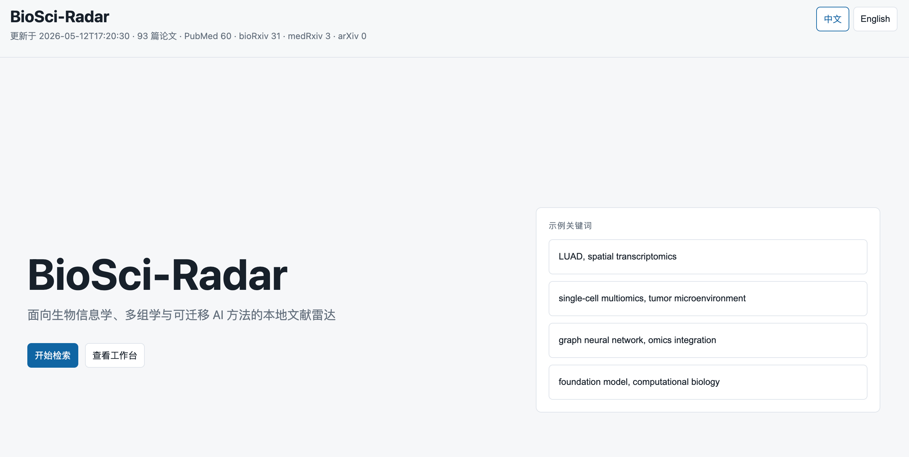
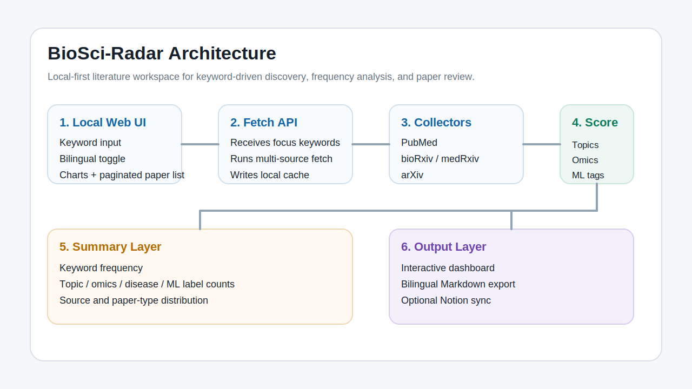
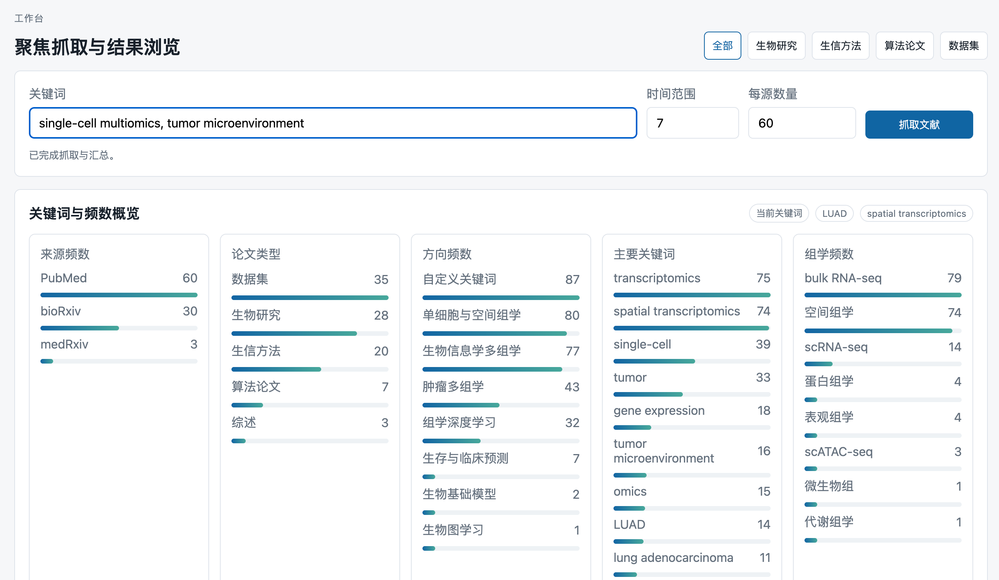

# BioSci-Radar

中文 | [English](README.md)

BioSci-Radar 是一个面向生物信息学、多组学分析以及可迁移机器学习/深度学习方法的本地文献工作台。它会先展示一个双语初始页面，你可以从示例关键词直接启动，也可以手动输入主题，然后下滑进入工作台查看频数概览和分页后的论文列表。



## 它能做什么

BioSci-Radar 的定位是面向研究使用的本地 Web 工具，而不是单纯的命令行抓取脚本。

- 从 `PubMed`、`bioRxiv`、`medRxiv`、`arXiv` 抓取论文
- 支持临时关键词抓取，比如 `LUAD`、`spatial transcriptomics`、`graph neural network`
- 自动把论文分成 `生物研究`、`生信方法`、`算法论文`、`数据集`、`综述`
- 汇总关键词、方向、组学、疾病、算法标签等频数
- 导出中英双语 Markdown
- 可选同步到 Notion 数据库



## 工作流

1. 打开首页
2. 点击示例关键词，或输入你自己的主题
3. 下滑进入工作台并发起抓取
4. 看关键词和标签频数统计
5. 浏览分页后的论文列表
6. 按需导出 Markdown 或同步到 Notion




## 快速开始

```bash
cd "/Users/xzw/Documents/New project 3/BioSci-Radar"
cp config.example.toml config.toml
python3 -m pip install -e .
```

启动本地页面：

```bash
PYTHONPATH=src python3 -m biosci_radar serve --port 8765
```

然后打开：

`http://127.0.0.1:8765`

## 使用教程

### 方式一：直接用本地页面

1. 打开 `http://127.0.0.1:8765`
2. 先使用初始页面：
   - 点击示例关键词，立即发起一次聚焦抓取，或
   - 点击 `开始检索` 后在工作台中输入你自己的主题
3. 在工作台关键词输入框中填入你要看的方向，例如：
   `LUAD, spatial transcriptomics, graph neural network`
4. 设置时间范围和每个来源抓取多少篇
5. 点击 `抓取文献`
6. 页面会自动更新三块内容：
   - 关键词和标签频数
   - 来源、论文类型、方向、组学、疾病、算法标签统计
   - 分页后的文献列表
7. 右上角可切换 `中文 / English`

### 方式二：用命令行

按默认配置抓取：

```bash
biosci-radar fetch --days 14 --limit 80
```

按临时关键词抓取：

```bash
biosci-radar fetch --focus "LUAD, spatial transcriptomics, graph neural network" --days 14 --limit 40
```

也可以直接用模块方式：

```bash
PYTHONPATH=src python3 -m biosci_radar fetch --focus "LUAD, spatial transcriptomics" --days 7 --limit 20
PYTHONPATH=src python3 -m biosci_radar serve --port 8765
```

## 常用命令

```bash
biosci-radar fetch
biosci-radar fetch --focus "single-cell multiomics, survival prediction"
biosci-radar serve
biosci-radar export-md --lang both
biosci-radar notion-sync --min-score 0.45
biosci-radar show-config
```

## 输出文件

- `data/papers/latest.json`：最新抓取结果和统计摘要
- `data/papers/YYYY-MM-DD.json`：按日期保存的抓取快照
- `data/exports/recommendations.zh.md`：中文 Markdown 导出
- `data/exports/recommendations.en.md`：英文 Markdown 导出
- `data/notion_sync.json`：Notion 同步状态

## Notion 同步

1. 创建 Notion integration
2. 创建论文数据库，并共享给该 integration
3. 设置环境变量：

```bash
export NOTION_TOKEN="secret_..."
export NOTION_PAPERS_DATABASE_ID="..."
```

4. 执行同步：

```bash
biosci-radar notion-sync --min-score 0.45
```

字段说明见：[docs/notion_schema.zh.md](docs/notion_schema.zh.md)

## 当前范围

- 只依赖 Python 标准库
- 不强制依赖数据库
- 不强制依赖 LLM API key
- 当前采用规则抓取、规则分类、规则评分和规则汇总
- 设计重点是先本地浏览，再导出到 GitHub 或 Notion
